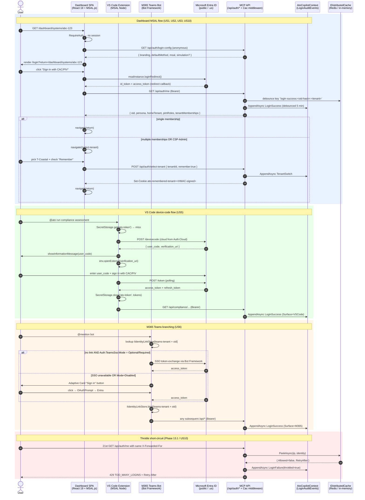

# Authentication Architecture

> This page describes the runtime auth flows added by
> [Feature 051 — First-Class Login Experience](../features/051-login.md).
> It complements
> [Feature 003 — CAC/PIV Authentication + PIM](https://github.com/azurenoops/ato-copilot/tree/main/specs/003-cac-auth-pim)
> (server-side JWT validation + role activation) and
> [Feature 048 — Tenant Isolation](https://github.com/azurenoops/ato-copilot/tree/main/specs/048-tenant-isolation)
> (CSP-Admin impersonation + tenant query filter).

## Surfaces and flows

ATO Copilot supports **three distinct auth flows** depending on the
client surface. They all converge on the same server-side
`CacAuthenticationMiddleware` + `LoginAuditEvents` table.



## Middleware ordering (`Program.cs`)

```text
CorrelationIdMiddleware           # W3C activity + Items["CorrelationId"]
SerilogRequestLogging
CorsMiddleware
RateLimiter                       # Per-endpoint sliding window (Feature 006)
RequestSizeLimitMiddleware
CacAuthenticationMiddleware       # JWT validation + amr=mfa,rsa
LoginThrottleMiddleware           # NEW Feature 051 — peek → short-circuit 429
TenantResolutionMiddleware        # Feature 048
ComplianceAuthorizationMiddleware # Tier 2 CAC gate, PIM tier enforcement
RequestMetricsMiddleware
AuditLoggingMiddleware            # Compliance audit (separate from LoginAuditEvents)
```

The throttle middleware is placed **after** `CacAuthenticationMiddleware`
so that the identity key (`oid` claim) is resolvable when present —
unauthenticated requests fall back to the `anonymous` identity bucket.

## Storage

| Concern | Storage | Lifetime |
| --- | --- | --- |
| `LoginAuditEvents` (hot table) | `AtoCopilotContext` DbSet | 13 months (FR-036a) |
| Login audit cold archive | `AzureBlobAppendArchiveSink` (prod) / `FileSystemArchiveSink` (dev) | Indefinite (immutable append-blob) |
| Throttle counters | `IDistributedCache` — Redis in prod, in-process memory in dev/test | 60-second sliding bucket |
| Remembered-tenant cookie | First-party HMAC-SHA256 signed cookie, no server mirror | `Auth:RememberTenantCookieDays` (default 30 days) |
| Impersonation cookie | First-party HMAC-SHA256 signed cookie (Feature 048) | `Auth:Impersonation:Lifetime` (default 1 hour) |
| MSAL.js access token | localStorage (dashboard) / SecretStorage (VS Code) | Token's `exp` claim — MSAL silent-renewal handles refresh |

## Configuration surface

```jsonc
// appsettings.json
{
  "Auth": {
    "DefaultMethod": "Cac",                   // Cac | Entra
    "IdleTimeoutMinutes": 30,
    "RememberTenantCookieDays": 30,
    "Cloud": "AzureUSGovernment",             // AzurePublic | AzureUSGovernment
    "VSCode": { "DeviceCodeProvider": "EntraDirect" },
    "Throttle": {
      "Development": { "PerIpPerMinute": 100, "PerIdentityPerMinute": 100 },
      "Production":  { "PerIpPerMinute": 20,  "PerIdentityPerMinute": 10  }
    },
    "TeamsSso": { "Mode": "Optional" },       // Required | Optional | Disabled
    "Archive": {
      "Sink": "AzureBlobAppend",              // AzureBlobAppend | FileSystem
      "RunHourUtc": 2
    },
    "Cookie": { "SigningKey": "<from-Key-Vault>" }  // Required outside Development
  }
}
```

`AuthOptionsValidator` fails the host at startup if `Cookie:SigningKey`
is missing in any non-`Development` environment.

## Cross-reference

- Feature 051 spec — [specs/051-login/spec.md](https://github.com/azurenoops/ato-copilot/blob/051-login/specs/051-login/spec.md)
- Feature 051 contracts — [specs/051-login/contracts/](https://github.com/azurenoops/ato-copilot/tree/051-login/specs/051-login/contracts)
- Feature 048 tenant isolation — [docs/architecture/tenant-isolation.md](./tenant-isolation.md)
