# Data Model

> Entity Framework Core data model — all entities, relationships, and ER diagram.

---

## Table of Contents

- [ER Diagram](#er-diagram)
- [RMF Lifecycle Entities](#rmf-lifecycle-entities)
- [Assessment Entities](#assessment-entities)
- [Authorization Entities](#authorization-entities)
- [Continuous Monitoring Entities](#continuous-monitoring-entities)
- [SSP & Document Entities](#ssp--document-entities)
- [STIG & Reference Entities](#stig--reference-entities)
- [eMASS & OSCAL Entities](#emass--oscal-entities)
- [Scan Import Entities](#scan-import-entities)
- [SAP Entities](#sap-entities)
- [Privacy Entities](#privacy-entities)
- [Interconnection Entities](#interconnection-entities)
- [SSP Authoring Entities](#ssp-authoring-entities)
- [Core Compliance Entities](#core-compliance-entities)
- [Kanban Entities](#kanban-entities)
- [Authentication Entities](#authentication-entities)
- [Compliance Watch Entities](#compliance-watch-entities)
- [Dashboard Entities](#dashboard-entities)
- [Implementation Roadmap Entities](#implementation-roadmap-entities-feature-031)
- [Database Configuration](#database-configuration)
- [Enumerations](#enumerations)

---

## ER Diagram

```mermaid
erDiagram
    RegisteredSystem ||--o| SecurityCategorization : has
    RegisteredSystem ||--o| ControlBaseline : has
    RegisteredSystem ||--o| ConMonPlan : has
    RegisteredSystem ||--o{ AuthorizationBoundary : contains
    RegisteredSystem ||--o{ AuthorizationBoundaryDefinition : defines
    AuthorizationBoundaryDefinition ||--o{ AuthorizationBoundary : groups
    AuthorizationBoundaryDefinition ||--o{ SystemComponent : scopes
    AuthorizationBoundaryDefinition ||--o{ CapabilityControlMapping : scopes
    RegisteredSystem ||--o{ RmfRoleAssignment : has
    RegisteredSystem ||--o{ ControlImplementation : has
    ControlImplementation ||--o{ NarrativeVersion : versions
    ControlImplementation ||--o| NarrativeVersion : approved
    NarrativeVersion ||--o{ NarrativeReview : reviews
    RegisteredSystem ||--o{ AssessmentRecord : has
    RegisteredSystem ||--o{ AuthorizationDecision : has
    RegisteredSystem ||--o{ PoamItem : has
    RegisteredSystem ||--o{ SignificantChange : has

    SecurityCategorization ||--o{ InformationType : contains

    ControlBaseline ||--o{ ControlTailoring : has
    ControlBaseline ||--o{ ControlInheritance : has
    ControlInheritance }o--o| OrgInheritanceDefault : "derived from"

    AssessmentRecord ||--o{ ControlEffectiveness : has

    AuthorizationDecision ||--o{ RiskAcceptance : has
    AuthorizationDecision ||--o| AuthorizationDecision : supersedes

    PoamItem ||--o{ PoamMilestone : has
    PoamItem }o--o| RemediationTask : links

    ConMonPlan ||--o{ ConMonReport : generates

    ComplianceAssessment ||--o{ ComplianceFinding : produces
    ComplianceAssessment ||--o| RemediationBoard : creates

    RemediationBoard ||--o{ RemediationTask : contains
    RemediationTask ||--o{ TaskComment : has
    RemediationTask ||--o{ TaskHistoryEntry : has

    ComplianceAlert ||--o{ AlertNotification : sends
    ComplianceAlert ||--o{ ComplianceAlert : correlates

    RegisteredSystem ||--o{ ScanImportRecord : has
    RegisteredSystem ||--o{ SecurityAssessmentPlan : has
    RegisteredSystem ||--o| PrivacyThresholdAnalysis : has
    RegisteredSystem ||--o{ PrivacyImpactAssessment : has
    RegisteredSystem ||--o{ SystemInterconnection : has
    RegisteredSystem ||--o{ SspSection : has

    ScanImportRecord ||--o{ ScanImportFinding : contains
    SecurityAssessmentPlan ||--o{ SapControlEntry : contains
    SecurityAssessmentPlan ||--o{ SapTeamMember : has
    SecurityAssessmentPlan ||--o{ SapMethodOverride : has
    PrivacyImpactAssessment ||--o{ PiaSection : contains
    SystemInterconnection ||--o| InterconnectionAgreement : has

    RegisteredSystem ||--o{ ImplementationRoadmap : has
    ImplementationRoadmap ||--o{ RoadmapPhase : contains
    RoadmapPhase ||--o{ RoadmapItem : contains
    RoadmapItem }o--o| RemediationTask : links
    ImplementationRoadmap ||--o| RemediationBoard : links

    SystemComponent ||--o{ ComponentCapabilityLink : has
    SystemComponent ||--o{ ComponentSystemAssignment : assigned
    ComponentCapabilityLink }o--|| SecurityCapability : links
    ComponentSystemAssignment }o--|| RegisteredSystem : scopes
    SecurityCapability ||--o{ CapabilityControlMapping : maps
```



---

## RMF Lifecycle Entities

### RegisteredSystem

The anchor entity for all RMF workflow data. Tracks a system through the 7-step RMF lifecycle.

| Property | Type | Description |
|----------|------|-------------|
| `Id` | `Guid` | Primary key |
| `Name` | `string` (200) | System name |
| `Acronym` | `string?` (50) | System acronym |
| `SystemType` | `SystemType` enum | Major Application, GSS, Enclave, etc. |
| `MissionCriticality` | `MissionCriticality` enum | Critical, Essential, Support |
| `HostingEnvironment` | `AzureCloudEnvironment` enum | Commercial, GovCloud, IL5, IL6 |
| `Description` | `string?` (2000) | System description |
| `CurrentRmfStep` | `RmfPhase` enum | Current lifecycle phase |
| `IsActive` | `bool` | Whether the system is active |
| `RmfStepUpdatedAt` | `DateTime?` | When the RMF step last changed |
| `AzureProfile` | `AzureEnvironmentProfile` | Owned entity — subscription, tenant, region |
| `CreatedAt` | `DateTime` | Creation timestamp |
| `UpdatedAt` | `DateTime` | Last update timestamp |
| `OperationalStatus` | `OperationalStatus` enum | Operational, UnderDevelopment, etc. (F022) |
| `SystemStartDate` | `DateTime?` | System operational start date (F022) |
| `HasNoExternalInterconnections` | `bool` | Certified no external connections (F021) |

**Owned Entity — AzureEnvironmentProfile:**

| Property | Type | Description |
|----------|------|-------------|
| `SubscriptionId` | `string?` | Azure subscription ID |
| `TenantId` | `string?` | Azure tenant ID |
| `Region` | `string?` | Azure region |

**Navigation Properties:** `SecurityCategorization`, `ControlBaseline`, `AuthorizationBoundaries`, `RmfRoleAssignments`

### AuthorizationBoundary

Azure resources within a system's authorization boundary.

| Property | Type | Description |
|----------|------|-------------|
| `Id` | `Guid` | Primary key |
| `SystemId` | `Guid` | FK → RegisteredSystem |
| `ResourceId` | `string` (500) | Azure resource ID |
| `ResourceType` | `string` (200) | Azure resource type |
| `ResourceName` | `string` (200) | Resource display name |
| `IsExcluded` | `bool` | Whether excluded from boundary |
| `ExclusionRationale` | `string?` (2000) | Justification for exclusion |
| `AuthorizationBoundaryDefinitionId` | `string?` (36) | FK → AuthorizationBoundaryDefinition (nullable — null = legacy/org-wide) |
| `AddedAt` | `DateTime` | When resource was added |

### AuthorizationBoundaryDefinition (Feature 033)

A named security perimeter within a registered system (e.g., "Production", "Dev/Test").

| Property | Type | Description |
|----------|------|-------------|
| `Id` | `Guid` | Primary key |
| `RegisteredSystemId` | `string` (36) | FK → RegisteredSystem |
| `Name` | `string` (200) | Boundary name (unique within system) |
| `BoundaryType` | `BoundaryDefinitionType` | Physical, Logical, or Hybrid |
| `Description` | `string?` (2000) | Free-text description |
| `IsPrimary` | `bool` | Whether this is the primary boundary (one per system, cannot be deleted) |
| `CreatedAt` | `DateTime` | Creation timestamp (UTC) |
| `CreatedBy` | `string` (200) | User who created the definition |

**Relationships**: Contains many `AuthorizationBoundary` resources, `SystemComponent` entries, and `CapabilityControlMapping` records.

### RmfRoleAssignment

Personnel assigned to RMF roles for a system.

| Property | Type | Description |
|----------|------|-------------|
| `Id` | `Guid` | Primary key |
| `SystemId` | `Guid` | FK → RegisteredSystem |
| `Role` | `RmfRole` enum | AO, ISSM, ISSO, SCA, SystemOwner |
| `UserId` | `string` (200) | User principal name |
| `UserDisplayName` | `string` (200) | Display name |
| `IsActive` | `bool` | Whether currently assigned |
| `AssignedAt` | `DateTime` | Assignment timestamp |

---

## Assessment Entities

### SecurityCategorization

FIPS 199 categorization for a registered system. One-to-one with RegisteredSystem (unique index on `SystemId`).

| Property | Type | Description |
|----------|------|-------------|
| `Id` | `Guid` | Primary key |
| `SystemId` | `Guid` | FK → RegisteredSystem (unique) |
| `ConfidentialityImpact` | `ImpactValue` | Computed high-water mark |
| `IntegrityImpact` | `ImpactValue` | Computed high-water mark |
| `AvailabilityImpact` | `ImpactValue` | Computed high-water mark |
| `OverallCategorization` | `ImpactValue` | Max of C/I/A |
| `DoDImpactLevel` | `string` | IL2, IL4, IL5, IL6 |
| `NistBaseline` | `string` | Low, Moderate, High |
| `FormalNotation` | `string` | FIPS 199 SC notation |
| `IsNationalSecuritySystem` | `bool` | NSS flag |
| `Justification` | `string?` | Categorization rationale |
| `CategorizedAt` | `DateTime` | Categorization timestamp |
| `CategorizedBy` | `string?` | User who categorized |

**Navigation:** `InformationTypes` (collection)

### InformationType

SP 800-60 information types associated with a security categorization.

| Property | Type | Description |
|----------|------|-------------|
| `Id` | `Guid` | Primary key |
| `CategorizationId` | `Guid` | FK → SecurityCategorization |
| `Sp80060Id` | `string` | SP 800-60 identifier |
| `Name` | `string` | Information type name |
| `Category` | `string?` | Category grouping |
| `ConfidentialityImpact` | `ImpactValue` | C impact level |
| `IntegrityImpact` | `ImpactValue` | I impact level |
| `AvailabilityImpact` | `ImpactValue` | A impact level |
| `UsesProvisional` | `bool` | Uses provisional impact |
| `AdjustmentJustification` | `string?` | If not using provisional |

### ControlBaseline

NIST 800-53 control baseline selected for a system. One-to-one with RegisteredSystem.

| Property | Type | Description |
|----------|------|-------------|
| `Id` | `Guid` | Primary key |
| `SystemId` | `Guid` | FK → RegisteredSystem (unique) |
| `BaselineLevel` | `string` | Low, Moderate, High |
| `OverlayApplied` | `string?` | CNSSI 1253 overlay name |
| `ControlIds` | `List<string>` | Selected control IDs (JSON serialized) |
| `CreatedBy` | `string?` | User who selected baseline |
| `CreatedAt` | `DateTime` | Selection timestamp |
| `UpdatedAt` | `DateTime` | Last update |

**Navigation:** `Tailorings` (collection), `Inheritances` (collection)

### ControlTailoring

Tailoring actions (add/remove) applied to a baseline.

| Property | Type | Description |
|----------|------|-------------|
| `Id` | `Guid` | Primary key |
| `BaselineId` | `Guid` | FK → ControlBaseline |
| `ControlId` | `string` | NIST control ID |
| `Action` | `TailoringAction` | Added or Removed |
| `Rationale` | `string` | Justification for action |
| `TailoredAt` | `DateTime` | Timestamp |

### ControlInheritance

Inheritance designation for controls in a baseline.

| Property | Type | Description |
|----------|------|-------------|
| `Id` | `Guid` | Primary key |
| `BaselineId` | `Guid` | FK → ControlBaseline |
| `ControlId` | `string` | NIST control ID |
| `InheritanceType` | `InheritanceType` | Inherited, Shared, Customer |
| `Provider` | `string?` | CSP or provider name |
| `CustomerResponsibility` | `string?` | Customer-specific responsibility |
| `DesignationSource` | `string?` (20) | Source of designation: OrgDerived, Manual, ProfileApply, CrmImport, BulkUpdate (Feature 044) |
| `OrgInheritanceDefaultId` | `string?` (36) | FK → OrgInheritanceDefault — tracks which org default this was derived from (Feature 044) |
| `DesignatedAt` | `DateTime` | Timestamp |

### OrgInheritanceDefault (Feature 044)

Org-level inheritance defaults derived from capability control mappings. One per control ID.

| Property | Type | Description |
|----------|------|-------------|
| `Id` | `Guid` | Primary key |
| `ControlId` | `string` (20) | NIST control ID (unique index) |
| `InheritanceType` | `InheritanceType` | Inherited or Shared |
| `Provider` | `string` (500) | Merged provider names from capabilities |
| `SourceCapabilityIds` | `string` (2000) | Comma-separated capability IDs |
| `SourceCapabilityNames` | `string` (2000) | Comma-separated capability names |
| `MappingRole` | `CapabilityMappingRole` | Winning role: Primary, Supporting, or Shared |
| `DerivedAt` | `DateTime` | When the default was last derived |

**Relationships:** Referenced by `ControlInheritance.OrgInheritanceDefaultId`

---

## SSP & Document Entities

### ControlImplementation

Per-control SSP narrative with implementation status and governance tracking. Unique composite index on `(SystemId, ControlId)`.

| Property | Type | Description |
|----------|------|-------------|
| `Id` | `Guid` | Primary key |
| `SystemId` | `Guid` | FK → RegisteredSystem |
| `ControlId` | `string` | NIST control ID |
| `Narrative` | `string` | Implementation narrative (current draft) |
| `ImplementationStatus` | `ImplementationStatus` | Implemented, Partial, Planned, N/A |
| `IsAutoPopulated` | `bool` | Auto-populated from inheritance |
| `AiSuggested` | `bool` | Generated by AI suggestion |
| `ApprovalStatus` | `SspSectionStatus` | Governance status: NotStarted, Draft, UnderReview, Approved, NeedsRevision |
| `CurrentVersion` | `int` | Current version number (default: 1) |
| `ApprovedVersionId` | `Guid?` | FK → NarrativeVersion (approved version) |
| `CreatedAt` | `DateTime` | Creation timestamp |
| `UpdatedAt` | `DateTime` | Last update |

### NarrativeVersion

> Feature 024: Narrative Governance

Immutable version record for a control narrative. Composite unique index on `(ControlImplementationId, VersionNumber)`.

| Property | Type | Description |
|----------|------|-------------|
| `Id` | `Guid` | Primary key |
| `ControlImplementationId` | `Guid` | FK → ControlImplementation (cascade delete) |
| `VersionNumber` | `int` | Sequential version number |
| `Content` | `string` | Full narrative content for this version |
| `Status` | `SspSectionStatus` | Status at time of creation |
| `AuthoredBy` | `string` | User who authored this version |
| `AuthoredAt` | `DateTime` | Authoring timestamp |
| `ChangeReason` | `string?` | Optional reason for the edit |
| `SubmittedBy` | `string?` | User who submitted for review |
| `SubmittedAt` | `DateTime?` | Submission timestamp |

### NarrativeReview

> Feature 024: Narrative Governance

Review decision record for a narrative version.

| Property | Type | Description |
|----------|------|-------------|
| `Id` | `Guid` | Primary key |
| `NarrativeVersionId` | `Guid` | FK → NarrativeVersion (cascade delete) |
| `ReviewedBy` | `string` | Reviewer (ISSM) user ID |
| `Decision` | `ReviewDecision` | Approve or RequestRevision |
| `ReviewerComments` | `string?` | Reviewer feedback |
| `ReviewedAt` | `DateTime` | Review timestamp |

### ReviewDecision Enum

| Value | Description |
|-------|-------------|
| `Approve` | Narrative approved for SSP inclusion |
| `RequestRevision` | Narrative needs changes before approval |

---

## Assessment Entities (Continued)

### AssessmentRecord

Immutable assessment snapshot for a system. Unique composite index on `(SystemId, AssessmentId)`.

| Property | Type | Description |
|----------|------|-------------|
| `Id` | `Guid` | Primary key |
| `SystemId` | `Guid` | FK → RegisteredSystem |
| `AssessmentId` | `string` | Assessment session ID |
| `SnapshotData` | `string` | JSON snapshot of all determinations |
| `ComplianceScore` | `decimal` | Score at snapshot time |
| `IntegrityHash` | `string` | SHA-256 hash for tamper detection |
| `IsImmutable` | `bool` | Cannot be modified after creation |
| `CapturedAt` | `DateTime` | Capture timestamp |
| `CapturedBy` | `string?` | User who captured snapshot |

### ControlEffectiveness

Per-control effectiveness determination from an assessment.

| Property | Type | Description |
|----------|------|-------------|
| `Id` | `Guid` | Primary key |
| `AssessmentId` | `string` | Assessment session ID |
| `ControlId` | `string` | NIST control ID |
| `Determination` | `EffectivenessDetermination` | Satisfied or OtherThanSatisfied |
| `CatSeverity` | `CatSeverity?` | CAT I/II/III (if OtherThanSatisfied) |
| `Method` | `string` | Test, Interview, Examine |
| `Notes` | `string?` | Assessment notes |
| `EvidenceIds` | `string?` | Comma-separated evidence IDs |
| `AssessedAt` | `DateTime` | Assessment timestamp |
| `AssessedBy` | `string?` | Assessor user ID |

---

## Authorization Entities

### AuthorizationDecision

ATO/IATT/DATO/ATO with Conditions decision for a system.

| Property | Type | Description |
|----------|------|-------------|
| `Id` | `Guid` | Primary key |
| `SystemId` | `Guid` | FK → RegisteredSystem |
| `DecisionType` | `AuthorizationDecisionType` | ATO, AtoWithConditions, IATT, DATO |
| `DecisionDate` | `DateTime` | When decision was issued |
| `ExpirationDate` | `DateTime?` | Authorization expiration |
| `ResidualRiskLevel` | `string` | Low, Medium, High, Critical |
| `ResidualRiskJustification` | `string?` | Risk rationale |
| `TermsAndConditions` | `string?` | Conditions (for ATOwC) |
| `ComplianceScore` | `decimal` | Score at decision time |
| `IsActive` | `bool` | Currently active decision |
| `SupersededById` | `Guid?` | Self-referencing FK |
| `FindingsAtDecision` | `string?` | JSON snapshot of open findings |
| `IssuedBy` | `string?` | AO user ID |
| `IssuedAt` | `DateTime` | Issuance timestamp |

### RiskAcceptance

Formal risk acceptance linked to an authorization decision.

| Property | Type | Description |
|----------|------|-------------|
| `Id` | `Guid` | Primary key |
| `AuthorizationDecisionId` | `Guid` | FK → AuthorizationDecision |
| `FindingId` | `string` | Associated finding ID |
| `ControlId` | `string` | NIST control ID |
| `CatSeverity` | `CatSeverity` | CAT I/II/III |
| `Justification` | `string` | Risk acceptance rationale |
| `CompensatingControl` | `string?` | Compensating control description |
| `ExpirationDate` | `DateTime?` | When acceptance expires |
| `IsActive` | `bool` | Currently active |
| `AcceptedBy` | `string?` | AO user ID |
| `AcceptedAt` | `DateTime` | Acceptance timestamp |

### PoamItem

Plan of Action & Milestones entry.

| Property | Type | Description |
|----------|------|-------------|
| `Id` | `Guid` | Primary key |
| `SystemId` | `Guid` | FK → RegisteredSystem |
| `FindingId` | `string?` | Associated finding ID |
| `Weakness` | `string` | Weakness description |
| `ControlId` | `string` | NIST control ID |
| `CatSeverity` | `CatSeverity` | CAT I/II/III |
| `Poc` | `string` | Point of contact |
| `ScheduledCompletion` | `DateTime` | Target completion date |
| `ResourcesRequired` | `string?` | Resources needed |
| `Status` | `PoamStatus` | Ongoing, Completed, Delayed, RiskAccepted |
| `CreatedAt` | `DateTime` | Creation timestamp |

**Navigation:** `Milestones` (collection)

### PoamMilestone

Milestone within a POA&M item.

| Property | Type | Description |
|----------|------|-------------|
| `Id` | `Guid` | Primary key |
| `PoamItemId` | `Guid` | FK → PoamItem |
| `Description` | `string` | Milestone description |
| `TargetDate` | `DateTime` | Target date |
| `CompletedDate` | `DateTime?` | Actual completion date |
| `Sequence` | `int` | Display order |

---

## Continuous Monitoring Entities

### ConMonPlan

Continuous monitoring plan for a system. One-to-one with RegisteredSystem.

| Property | Type | Description |
|----------|------|-------------|
| `Id` | `Guid` | Primary key |
| `SystemId` | `Guid` | FK → RegisteredSystem (unique) |
| `AssessmentFrequency` | `string` | Monthly, Quarterly, Annually |
| `AnnualReviewDate` | `DateTime` | Annual plan review date |
| `ReportDistribution` | `string` | JSON list of recipients |
| `SignificantChangeTriggers` | `string` | JSON list of custom triggers |
| `CreatedAt` | `DateTime` | Creation timestamp |
| `UpdatedAt` | `DateTime` | Last update |

### ConMonReport

Periodic compliance report generated from a ConMon plan.

| Property | Type | Description |
|----------|------|-------------|
| `Id` | `Guid` | Primary key |
| `PlanId` | `Guid` | FK → ConMonPlan |
| `ReportType` | `string` | Monthly, Quarterly, Annual |
| `Period` | `string` | Report period (e.g., "2026-02") |
| `ComplianceScore` | `decimal` | Current score |
| `ScoreDelta` | `decimal` | Drift from authorization baseline |
| `ReportContent` | `string` | Markdown report content |
| `GeneratedAt` | `DateTime` | Generation timestamp |

### SignificantChange

Change event that may trigger reauthorization.

| Property | Type | Description |
|----------|------|-------------|
| `Id` | `Guid` | Primary key |
| `SystemId` | `Guid` | FK → RegisteredSystem |
| `ChangeType` | `string` | One of 10+ trigger types |
| `Description` | `string` | Change description |
| `RequiresReauthorization` | `bool` | Auto-classified flag |
| `Disposition` | `string?` | reviewed, reauthorization_triggered, etc. |
| `ReportedAt` | `DateTime` | Report timestamp |
| `ReportedBy` | `string?` | Reporter user ID |

---

## STIG & Reference Entities

### StigControl

STIG check from XCCDF benchmark parsed data.

| Property | Type | Description |
|----------|------|-------------|
| `StigId` | `string` | Primary key (e.g., V-12345) |
| `Title` | `string` | STIG rule title |
| `Description` | `string` | Full description |
| `CatSeverity` | `string` | CAT I, II, or III |
| `FixText` | `string?` | Remediation guidance |
| `CheckContent` | `string?` | Verification procedure |
| `BenchmarkId` | `string?` | Parent benchmark |

### StigBenchmark

STIG benchmark metadata.

| Property | Type | Description |
|----------|------|-------------|
| `BenchmarkId` | `string` | Primary key |
| `Title` | `string` | Benchmark title |
| `Version` | `string` | Benchmark version |
| `ReleaseDate` | `DateTime` | Release date |
| `Technology` | `string` | Target technology |

### CciMapping

CCI-to-NIST control cross-reference.

| Property | Type | Description |
|----------|------|-------------|
| `CciId` | `string` | CCI identifier |
| `NistControlId` | `string` | NIST 800-53 control |

---

## eMASS & OSCAL Entities

### EmassControlExportRow (DTO)

Flat row structure for eMASS Excel export (25 fields including System Name, Control Identifier, Implementation Status, Narrative, Responsible Entities, etc.)

### EmassPoamExportRow (DTO)

Flat row structure for eMASS POA&M Excel export (24 fields including POA&M ID, Weakness, Security Control Number, Milestones, etc.)

---

## Scan Import Entities

### ScanImportRecord

Tracks each CKL/XCCDF/Prisma file import operation (Feature 017, enhanced by Feature 019).

| Property | Type | Description |
|----------|------|-------------|
| `Id` | `Guid` | Primary key |
| `SystemId` | `Guid` | FK → RegisteredSystem |
| `ImportType` | `ScanImportType` enum | CKL, XCCDF, PrismaCloudCsv, PrismaCloudApi |
| `Status` | `ScanImportStatus` enum | Pending, Completed, Failed, PartiallyCompleted |
| `FileName` | `string?` | Original file name |
| `BenchmarkId` | `string?` | STIG benchmark identifier |
| `BenchmarkTitle` | `string?` | STIG benchmark title |
| `ImportedBy` | `string` | User who initiated the import |
| `ImportedAt` | `DateTime` | Import timestamp |
| `FindingsCreated` | `int` | Count of new findings |
| `FindingsUpdated` | `int` | Count of updated findings |
| `FindingsSkipped` | `int` | Count of skipped findings |
| `FindingsErrored` | `int` | Count of error findings |
| `TotalFindings` | `int` | Total findings in source |

**Navigation Properties:** `Findings` (ScanImportFinding collection), `System` (RegisteredSystem)

### ScanImportFinding

Individual finding from a scan import (Feature 017, enhanced by Feature 019 with Prisma fields).

| Property | Type | Description |
|----------|------|-------------|
| `Id` | `Guid` | Primary key |
| `ImportRecordId` | `Guid` | FK → ScanImportRecord |
| `StigId` | `string?` | STIG rule ID (CKL/XCCDF) |
| `NistControlId` | `string?` | Mapped NIST 800-53 control |
| `Status` | `FindingStatus` enum | Open, Resolved, etc. |
| `Severity` | `FindingSeverity` enum | CAT severity level |
| `Action` | `ImportFindingAction` enum | Created, Updated, Skipped, Error |
| `Title` | `string?` | Finding title |
| `Description` | `string?` | Finding description |
| `PrismaPolicyId` | `string?` | Prisma Cloud policy ID (F019) |
| `PrismaCloudType` | `string?` | Cloud provider type (F019) |
| `ResourceArn` | `string?` | Cloud resource ARN/ID (F019) |
| `RemediationGuidance` | `string?` | Human-readable remediation (F019) |
| `RemediationScript` | `string?` | CLI remediation script (F019 API only) |
| `AutoRemediable` | `bool` | Whether auto-remediation is available (F019) |

### PrismaPolicy

Prisma Cloud policy catalog cache (Feature 019).

| Property | Type | Description |
|----------|------|-------------|
| `Id` | `string` | Prisma policy ID (primary key) |
| `PolicyName` | `string` | Policy display name |
| `Severity` | `string` | Prisma severity level |
| `NistControlIds` | `List<string>` | Mapped NIST 800-53 control IDs (JSON) |
| `CloudType` | `string` | Target cloud provider |
| `OpenCount` | `int` | Current open finding count |
| `ResolvedCount` | `int` | Resolved finding count |
| `LastSeenImportId` | `Guid?` | Last import that referenced this policy |

### PrismaTrendRecord

Periodic trend data for Prisma Cloud ConMon (Feature 019).

| Property | Type | Description |
|----------|------|-------------|
| `Id` | `Guid` | Primary key |
| `SystemId` | `Guid` | FK → RegisteredSystem |
| `RecordedAt` | `DateTime` | Trend snapshot timestamp |
| `TotalFindings` | `int` | Total findings at this point |
| `OpenFindings` | `int` | Open findings |
| `ResolvedFindings` | `int` | Resolved findings |
| `NewFindings` | `int` | New since last snapshot |
| `RemediationRate` | `decimal` | Remediation percentage |

---

## SAP Entities

### SecurityAssessmentPlan

SAP header with status, schedule, and integrity hash (Feature 018).

| Property | Type | Description |
|----------|------|-------------|
| `Id` | `Guid` | Primary key |
| `SystemId` | `Guid` | FK → RegisteredSystem |
| `Title` | `string` | SAP title |
| `Status` | `SapStatus` enum | Draft, InReview, Approved, Active, Completed |
| `AssessmentScope` | `string` | Assessment scope description |
| `Methodology` | `string` | Assessment methodology narrative |
| `ScheduledStartDate` | `DateTime?` | Planned assessment start |
| `ScheduledEndDate` | `DateTime?` | Planned assessment end |
| `FinalizedAt` | `DateTime?` | When SAP was locked |
| `FinalizedHash` | `string?` | SHA-256 hash of finalized SAP |
| `CreatedBy` | `string` | Creator user |
| `CreatedAt` | `DateTime` | Creation timestamp |
| `UpdatedAt` | `DateTime` | Last update timestamp |

**Navigation Properties:** `ControlEntries`, `TeamMembers`, `MethodOverrides`, `System`

### SapControlEntry

Per-control assessment method assignment within a SAP (Feature 018).

| Property | Type | Description |
|----------|------|-------------|
| `Id` | `Guid` | Primary key |
| `SapId` | `Guid` | FK → SecurityAssessmentPlan |
| `ControlId` | `string` | NIST 800-53 control ID |
| `AssessmentMethod` | `AssessmentMethod` enum | Test, Interview, Examine |
| `AssessmentObjective` | `string?` | Specific assessment objective |

### SapTeamMember

Assessment team roster entry (Feature 018).

| Property | Type | Description |
|----------|------|-------------|
| `Id` | `Guid` | Primary key |
| `SapId` | `Guid` | FK → SecurityAssessmentPlan |
| `Name` | `string` | Team member name |
| `Role` | `TeamMemberRole` enum | Assessor, Lead, Observer, etc. |
| `Organization` | `string?` | Team member organization |

### SapMethodOverride

SCA-customized assessment method per control (Feature 018).

| Property | Type | Description |
|----------|------|-------------|
| `Id` | `Guid` | Primary key |
| `SapId` | `Guid` | FK → SecurityAssessmentPlan |
| `ControlId` | `string` | NIST 800-53 control ID |
| `OriginalMethod` | `AssessmentMethod` enum | Default method |
| `OverrideMethod` | `AssessmentMethod` enum | Customized method |
| `Justification` | `string` | Reason for override |

---

## Privacy Entities

### PrivacyThresholdAnalysis

PTA record with PII classification (Feature 021).

| Property | Type | Description |
|----------|------|-------------|
| `Id` | `Guid` | Primary key |
| `SystemId` | `Guid` | FK → RegisteredSystem |
| `CollectsPii` | `bool` | Whether system collects/processes PII |
| `PiiCategories` | `List<string>` | PII data categories (JSON) |
| `Determination` | `PtaDetermination` enum | PiaRequired, PiaNotRequired, Exempt |
| `Justification` | `string?` | Rationale for determination |
| `CompletedBy` | `string` | User who completed the PTA |
| `CompletedAt` | `DateTime` | Completion timestamp |

### PrivacyImpactAssessment

PIA header with version, status, and reviewer (Feature 021).

| Property | Type | Description |
|----------|------|-------------|
| `Id` | `Guid` | Primary key |
| `SystemId` | `Guid` | FK → RegisteredSystem |
| `Version` | `int` | PIA version number |
| `Status` | `PiaStatus` enum | Draft, InReview, Approved, Expired, Archived |
| `ReviewedBy` | `string?` | ISSM reviewer |
| `ReviewedAt` | `DateTime?` | Review timestamp |
| `ReviewNotes` | `string?` | Reviewer comments |
| `CreatedBy` | `string` | Author |
| `CreatedAt` | `DateTime` | Creation timestamp |
| `UpdatedAt` | `DateTime` | Last update |
| `ExpiresAt` | `DateTime?` | Annual review expiration |

**Navigation Properties:** `Sections` (PiaSection collection), `System`

### PiaSection

Individual PIA section (8 OMB M-03-22 sections) (Feature 021).

| Property | Type | Description |
|----------|------|-------------|
| `Id` | `Guid` | Primary key |
| `PiaId` | `Guid` | FK → PrivacyImpactAssessment |
| `SectionNumber` | `int` | Section sequence number (1–8) |
| `Title` | `string` | Section title |
| `Content` | `string` | Section narrative content |

---

## Interconnection Entities

### SystemInterconnection

System-to-system connection metadata (Feature 021).

| Property | Type | Description |
|----------|------|-------------|
| `Id` | `Guid` | Primary key |
| `SystemId` | `Guid` | FK → RegisteredSystem |
| `RemoteSystemName` | `string` | Name of connected system |
| `RemoteOrganization` | `string?` | Organization owning remote system |
| `RemoteContactName` | `string?` | POC for remote system |
| `RemoteContactEmail` | `string?` | POC email |
| `Direction` | `DataFlowDirection` enum | Inbound, Outbound, Bidirectional |
| `InterconnectionType` | `InterconnectionType` enum | Direct, VPN, API, etc. |
| `Protocol` | `string?` | Network protocol |
| `Port` | `int?` | Network port |
| `DataTypes` | `List<string>` | Data types transmitted (JSON) |
| `SecurityControls` | `string?` | Boundary security controls description |
| `Status` | `InterconnectionStatus` enum | Proposed, Active, Suspended, Terminated |
| `CreatedAt` | `DateTime` | Creation timestamp |
| `UpdatedAt` | `DateTime` | Last update |

**Navigation Properties:** `Agreement` (InterconnectionAgreement), `System`

### InterconnectionAgreement

ISA/MOU agreement tracking (Feature 021).

| Property | Type | Description |
|----------|------|-------------|
| `Id` | `Guid` | Primary key |
| `InterconnectionId` | `Guid` | FK → SystemInterconnection |
| `AgreementType` | `AgreementType` enum | ISA, MOU, MOA, SLA |
| `Status` | `AgreementStatus` enum | Draft, Pending, Active, Expired, Revoked |
| `EffectiveDate` | `DateTime?` | Agreement effective date |
| `ExpirationDate` | `DateTime?` | Agreement expiration date |
| `SignedBy` | `string?` | Authorizing official |
| `DocumentReference` | `string?` | Reference to agreement document |
| `CreatedAt` | `DateTime` | Creation timestamp |

---

## SSP Authoring Entities

### SspSection

Individual SSP section (13 NIST 800-18 sections) with status lifecycle (Feature 022).

| Property | Type | Description |
|----------|------|-------------|
| `Id` | `Guid` | Primary key |
| `SystemId` | `Guid` | FK → RegisteredSystem |
| `SectionNumber` | `int` | Section sequence (1–13) |
| `Title` | `string` | Section title (e.g., "System Identification") |
| `Content` | `string` | Section narrative content |
| `Status` | `SspSectionStatus` enum | NotStarted, Draft, InReview, Approved, NeedsRevision |
| `AuthoredBy` | `string?` | Section author |
| `ReviewedBy` | `string?` | ISSM reviewer |
| `ReviewedAt` | `DateTime?` | Review timestamp |
| `ReviewNotes` | `string?` | Reviewer comments |
| `CreatedAt` | `DateTime` | Creation timestamp |
| `UpdatedAt` | `DateTime` | Last update |

### ContingencyPlanReference

ISCP reference for SSP §13 (Feature 022).

| Property | Type | Description |
|----------|------|-------------|
| `Id` | `Guid` | Primary key |
| `SystemId` | `Guid` | FK → RegisteredSystem |
| `PlanTitle` | `string` | Contingency plan title |
| `LastTestedDate` | `DateTime?` | Date of last contingency plan test |
| `NextTestDate` | `DateTime?` | Scheduled next test |
| `PlanStatus` | `string` | Current plan status |

---

## Inventory Entities

### InventoryItem

HW/SW inventory item linked to a registered system (Feature 025).

| Property | Type | Description |
|----------|------|-------------|
| `Id` | `string(36)` | Primary key (GUID) |
| `RegisteredSystemId` | `string` | FK → RegisteredSystem |
| `ItemName` | `string(200)` | Display name |
| `Type` | `InventoryItemType` | `Hardware` or `Software` |
| `HardwareFunction` | `HardwareFunction?` | Server, Workstation, NetworkDevice, Storage, Other |
| `SoftwareFunction` | `SoftwareFunction?` | OperatingSystem, Database, Middleware, Application, SecurityTool, Other |
| `Manufacturer` | `string?` | Hardware manufacturer |
| `Model` | `string?` | Hardware model |
| `SerialNumber` | `string?` | Hardware serial number |
| `IpAddress` | `string?` | IP address (unique within system for active items) |
| `MacAddress` | `string?` | MAC address |
| `Location` | `string?` | Physical location |
| `Vendor` | `string?` | Software vendor |
| `Version` | `string?` | Software version |
| `PatchLevel` | `string?` | Current patch level |
| `LicenseType` | `string?` | License type |
| `Status` | `InventoryItemStatus` | `Active` or `Decommissioned` |
| `ParentHardwareId` | `string?` | Self-referencing FK for SW installed on HW |
| `BoundaryResourceId` | `string?` | FK linking to AuthorizationBoundary resource |
| `DecommissionDate` | `DateTime?` | When decommissioned |
| `DecommissionRationale` | `string?` | Reason for decommissioning |
| `CreatedBy` | `string` | Identity of creator |
| `CreatedAt` | `DateTime` | Creation timestamp |
| `ModifiedBy` | `string?` | Last modifier identity |
| `ModifiedAt` | `DateTime?` | Last modification timestamp |

**Relationships:**

- Many InventoryItems → one RegisteredSystem
- Self-referencing: Software → parent Hardware via `ParentHardwareId`
- Optional link to AuthorizationBoundary via `BoundaryResourceId` (auto-seed)

**Indexes:**

- Composite: `RegisteredSystemId` + `Type`
- Unique: `IpAddress` within system (for active items)

---

## Core Compliance Entities

| Entity | Purpose |
|--------|---------|
| `ComplianceAssessment` | Assessment run with status, score, finding counts |
| `ComplianceFinding` | Individual non-compliant finding with severity, status — enhanced with `ScanSourceType` and `ImportRecordId` (F017) |
| `NistControl` | NIST 800-53 control catalog entry (self-referential) |
| `RemediationPlan` | Prioritized remediation plan with steps |
| `ComplianceEvidence` | Collected audit evidence with integrity hash |
| `ComplianceDocument` | Generated SSP/POA&M/SAR with metadata |
| `AuditLogEntry` | Immutable audit record |

---

## Kanban Entities

| Entity | Purpose |
|--------|---------|
| `RemediationBoard` | Kanban board (from assessment or manual) |
| `RemediationTask` | Work item with status, assignee, priority |
| `TaskComment` | Comment on a task (24h edit, 1h delete window) |
| `TaskHistoryEntry` | Immutable change record |

---

## Authentication Entities

| Entity | Purpose |
|--------|---------|
| `CacSession` | CAC/PIV session with certificate validation |
| `JitRequest` | Just-in-time VM access request |
| `CertificateRoleMapping` | Certificate → role mapping |

---

## Compliance Watch Entities

| Entity | Purpose |
|--------|---------|
| `ComplianceAlert` | Compliance drift alert with severity |
| `AlertNotification` | Notification sent for an alert |
| `MonitoringConfiguration` | Per-subscription monitoring settings |
| `ComplianceBaseline` | Captured compliance snapshot (baseline) |
| `AlertRule` | Custom alert rule definition |
| `SuppressionRule` | Alert suppression by control/severity |
| `EscalationPath` | Alert escalation configuration |
| `AutoRemediationRule` | Auto-remediation rule definition |

---

## Database Configuration

### Provider Strategy

| Provider | Config Value | Use Case |
|----------|-------------|----------|
| SQLite | `"SQLite"` (default) | Development, single-instance |
| SQL Server | `"SqlServer"` | Production, multi-instance |

### Key Indexes

| Entity | Index | Type |
|--------|-------|------|
| `SecurityCategorization` | `SystemId` | Unique |
| `ControlBaseline` | `SystemId` | Unique |
| `ControlImplementation` | `(SystemId, ControlId)` | Unique composite |
| `AssessmentRecord` | `(SystemId, AssessmentId)` | Unique composite |
| `ConMonPlan` | `SystemId` | Unique |

### Concurrency

All `ConcurrentEntity` subclasses use optimistic concurrency via auto-regenerated `RowVersion` (Guid). `SaveChangesAsync` override detects modified entries and regenerates the version before flush.

### JSON Serialization

`List<string>` properties (e.g., `ControlBaseline.ControlIds`) are stored as JSON using a `ValueConverter<List<string>, string>`.

### Migrations

EF Core migrations run automatically at startup (`MigrateDatabaseAsync`) with a 30-second timeout. Failure exits the application (fail-fast).

---

## Enumerations

| Enum | Values |
|------|--------|
| `RmfPhase` | Prepare, Categorize, Select, Implement, Assess, Authorize, Monitor |
| `SystemType` | MajorApplication, GeneralSupportSystem, Enclave, PlatformIt, CloudServiceOffering |
| `MissionCriticality` | MissionCritical, MissionEssential, MissionSupport |
| `AzureCloudEnvironment` | Commercial, Government, GovernmentAirGappedIl5, GovernmentAirGappedIl6 |
| `ImpactValue` | Low, Moderate, High |
| `RmfRole` | AuthorizingOfficial, Issm, Isso, Sca, SystemOwner |
| `TailoringAction` | Added, Removed |
| `InheritanceType` | Inherited, Shared, Customer |
| `ImplementationStatus` | Implemented, PartiallyImplemented, Planned, NotApplicable |
| `EffectivenessDetermination` | Satisfied, OtherThanSatisfied |
| `CatSeverity` | CatI, CatII, CatIII |
| `AuthorizationDecisionType` | Ato, AtoWithConditions, IATT, DATO |
| `PoamStatus` | Ongoing, Completed, Delayed, RiskAccepted |
| `FindingSeverity` | Critical, High, Medium, Low, Informational |
| `FindingStatus` | Open, InProgress, Resolved, RiskAccepted, FalsePositive |
| `AssessmentStatus` | Running, Completed, Failed, Cancelled |
| `AlertSeverity` | Critical, High, Medium, Low, Informational |
| `AlertStatus` | Active, Acknowledged, Remediated, Dismissed |
| `TaskStatus` | Backlog, ToDo, InProgress, InReview, Done, Blocked |
| `ScanImportType` | CKL, Xccdf, PrismaCloudCsv, PrismaCloudApi, NessusXml |
| `ScanImportStatus` | Pending, Completed, Failed, PartiallyCompleted |
| `ImportFindingAction` | Created, Updated, Skipped, Error |
| `ScanSourceType` | Manual, StigViewer, ScapComplianceChecker, PrismaCloud, Nessus |
| `SapStatus` | Draft, InReview, Approved, Active, Completed |
| `AssessmentMethod` | Test, Interview, Examine |
| `TeamMemberRole` | Assessor, Lead, Observer, SystemOwner, Isso, Issm |
| `PtaDetermination` | PiaRequired, PiaNotRequired, Exempt |
| `PiaStatus` | Draft, InReview, Approved, Expired, Archived |
| `InterconnectionType` | Direct, Vpn, Api, Federated, Wireless, RemoteAccess |
| `DataFlowDirection` | Inbound, Outbound, Bidirectional |
| `InterconnectionStatus` | Proposed, Active, Suspended, Terminated |
| `AgreementType` | Isa, Mou, Moa, Sla |
| `AgreementStatus` | Draft, Pending, Active, Expired, Revoked |
| `SspSectionStatus` | NotStarted, Draft, InReview, Approved, NeedsRevision |
| `OperationalStatus` | Operational, UnderDevelopment, MajorModification, Disposition, Other |

---

## Enterprise Hardening Entities (Feature 029)

### Configuration Models (non-persisted)

| Entity | Purpose | Key Fields |
|--------|---------|------------|
| `ResiliencePipelineConfig` | Polly retry/circuit breaker settings | Name, MaxRetryAttempts, CircuitBreakerFailureThreshold |
| `RateLimitPolicy` | Per-endpoint rate limit rules | PolicyName, Endpoint, PermitLimit, WindowSeconds |
| `PaginationOptions` | Default/max page sizes | DefaultPageSize (50), MaxPageSize (100) |
| `StreamingOptions` | SSE buffer and keepalive settings | EventBufferSize (256), KeepaliveIntervalSeconds (15) |
| `OpenTelemetryOptions` | Metrics/tracing export config | ExporterType, OtlpEndpoint, EnablePrometheus |
| `OfflineCapability` | Capability network requirements | CapabilityName, RequiresNetwork, FallbackDescription |

### Persisted Entities

| Entity | Table | Purpose |
|--------|-------|---------|
| `CachedResponse` | `CachedResponses` | Persistent cache for offline mode |

**CachedResponse Fields**: Id, CacheKey (unique, max 256), ToolName, Response (JSON), CachedAt, TtlSeconds, Source, HitCount, SubscriptionId

**Indexes**: Unique on `CacheKey`, Non-unique on `(ToolName, SubscriptionId)`

---

## Dashboard Entities (Feature 030)

### SecurityCapability

Catalog entry for a reusable security solution mapped to NIST 800-53 controls.

| Field | Type | Description |
|-------|------|-------------|
| Id | string (PK) | GUID identifier |
| Name | string (200) | Unique capability name |
| Provider | string (200) | Technology provider |
| Category | string (10) | NIST control family code (e.g., "IA") |
| Description | string (8000) | Capability description |
| ImplementationStatus | CapabilityStatus | Planned / InProgress / Implemented / Deprecated |
| Owner | string (200) | Responsible team or role |
| CreatedAt, ModifiedAt | DateTime | Timestamps |
| CreatedBy, ModifiedBy | string | Audit fields |

**Indexes**: Unique on `Name`, Non-unique on `Category`

### CapabilityControlMapping

Maps a security capability to a specific NIST control with a role designation.

| Field | Type | Description |
|-------|------|-------------|
| Id | string (PK) | GUID identifier |
| SecurityCapabilityId | string (FK) | → SecurityCapability |
| ControlId | string (20) | NIST control ID (e.g., "AC-2") |
| RegisteredSystemId | string (FK, nullable) | System scope (null = org-wide) |
| Role | CapabilityMappingRole | Primary / Supporting / Shared |
| CreatedAt | DateTime | Creation timestamp |
| CreatedBy | string | Audit field |

**Indexes**: Unique composite on `(SecurityCapabilityId, ControlId, RegisteredSystemId)`

### SystemComponent

Physical or logical element of a system for SSP Appendix A (Person, Place, or Thing). Can be org-wide (nullable `RegisteredSystemId`) and assigned to systems via `ComponentSystemAssignment`.

| Field | Type | Description |
|-------|------|-------------|
| Id | string (PK) | GUID identifier |
| RegisteredSystemId | string (FK, nullable) | → RegisteredSystem (null = org-wide, F036) |
| Name | string (200) | Component name |
| ComponentType | ComponentType | Person / Place / Thing |
| SubType | string (100, nullable) | Sub-classification |
| Description | string (2000, nullable) | Component description |
| Owner | string (200, nullable) | Responsible party |
| Status | ComponentStatus | Active / Planned / Decommissioned |
| CreatedAt, ModifiedAt | DateTime | Timestamps |
| CreatedBy | string | Audit field |

**Navigation**: `CapabilityLinks` (many ComponentCapabilityLink), `SystemAssignments` (many ComponentSystemAssignment)

### ComponentSystemAssignment (Feature 036)

Assigns an org-wide component to a registered system with optional boundary scope.

| Field | Type | Description |
|-------|------|-------------|
| Id | string (PK) | GUID identifier |
| SystemComponentId | string (FK) | → SystemComponent |
| RegisteredSystemId | string (FK) | → RegisteredSystem |
| AuthorizationBoundaryDefinitionId | string (FK, nullable) | → AuthorizationBoundaryDefinition |
| CreatedAt | DateTime | Creation timestamp |
| CreatedBy | string | Audit field |

**Indexes**: Unique composite on `(SystemComponentId, RegisteredSystemId)`

### ComponentCapabilityLink

Join table linking components to capabilities (many-to-many).

| Field | Type | Description |
|-------|------|-------------|
| SystemComponentId | string (PK, FK) | → SystemComponent |
| SecurityCapabilityId | string (PK, FK) | → SecurityCapability |

### ComplianceTrendSnapshot

Point-in-time compliance metrics captured daily or after assessments.

| Field | Type | Description |
|-------|------|-------------|
| Id | string (PK) | GUID identifier |
| RegisteredSystemId | string (FK) | → RegisteredSystem |
| CapturedAt | DateTime | Snapshot timestamp |
| ComplianceScore | double | Score (0–100) |
| CatICount, CatIICount, CatIIICount | int | Finding counts by severity |
| OpenPoamCount, OverduePoamCount | int | POA&M counts |
| NarrativeCoverage | double | Narrative coverage (0–100) |
| Source | string (50) | "Scheduled" or "Assessment" |

**Indexes**: Non-unique on `(RegisteredSystemId, CapturedAt DESC)`

### DashboardActivity

Audit trail for dashboard-related events (component deletions, capability changes).

| Field | Type | Description |
|-------|------|-------------|
| Id | string (PK) | GUID identifier |
| RegisteredSystemId | string (FK) | → RegisteredSystem |
| EventType | string (100) | Event classification |
| Timestamp | DateTime | Event timestamp |
| Actor | string (200) | Who triggered the event |
| Summary | string (2000) | Human-readable description |
| RelatedEntityType | string (100, nullable) | Type of related entity |
| RelatedEntityId | string (36, nullable) | ID of related entity |

**Indexes**: Non-unique on `(RegisteredSystemId, Timestamp DESC)`

### Modified Entity: ControlImplementation

Two new fields added to support capability-driven narratives:

| Field | Type | Description |
|-------|------|-------------|
| SecurityCapabilityId | string (36, nullable FK) | → SecurityCapability that generated this narrative |
| IsManuallyCustomized | bool (default false) | True if user manually edited an auto-generated narrative |

---

## Implementation Roadmap Entities (Feature 031)

### ImplementationRoadmap

A versioned, phased action plan for closing compliance gaps on a specific system.

| Field | Type | Description |
|-------|------|-------------|
| Id | string (PK) | GUID identifier |
| SystemId | string (FK) | → RegisteredSystem |
| Name | string (200) | Roadmap name (e.g., "Eagle Eye Roadmap") |
| Status | RoadmapStatus | Draft / Active / Completed / Archived |
| TotalEstimatedEffort | double | Total effort in person-days |
| TotalRiskPoints | double | Sum of all gap risk points |
| LinkedBoardId | string (nullable FK) | → RemediationBoard (if Kanban bridge created) |
| Version | int | Incremented on each edit |
| RowVersion | string | Optimistic concurrency token |
| CreatedAt, UpdatedAt | DateTime | Timestamps |

**Business Rules**: Only one Active roadmap per system. Generating a new roadmap archives any existing Active roadmap.

**Indexes**: `IX_SystemId_Status` on `(SystemId, Status)`

### RoadmapPhase

A logical grouping of related controls within a roadmap, executed in sequence.

| Field | Type | Description |
|-------|------|-------------|
| Id | string (PK) | GUID identifier |
| RoadmapId | string (FK) | → ImplementationRoadmap |
| Name | string (200) | Phase name (e.g., "Critical Controls") |
| DisplayOrder | int | Phase sequence number |
| EstimatedEffort | double | Sum of item effort in person-days |
| RiskPoints | double | Sum of item risk points |
| RiskReductionPercent | double | Phase risk reduction contribution (%) |
| TargetStartWeek | int | Planned start week |
| TargetEndWeek | int | Planned end week |
| Status | PhaseStatus | NotStarted / InProgress / Complete |
| CompletedItemCount | int | Cached count of completed items |
| TotalItemCount | int | Cached count of total items |
| RowVersion | string | Optimistic concurrency token |

**Indexes**: `IX_RoadmapId_DisplayOrder` on `(RoadmapId, DisplayOrder)`

### RoadmapItem

An individual control gap assigned to a phase with effort estimate and role assignment.

| Field | Type | Description |
|-------|------|-------------|
| Id | string (PK) | GUID identifier |
| PhaseId | string (FK) | → RoadmapPhase |
| RoadmapId | string (FK) | → ImplementationRoadmap |
| ControlId | string (20) | NIST control ID (e.g., "AC-2") |
| GapType | GapType | Unmapped / PartiallyImplemented / NotAssessed |
| Severity | ItemSeverity | Critical / High / Medium |
| RiskPoints | double | Risk score based on severity |
| EstimatedEffortDays | double | Estimated effort in person-days |
| AssignedRole | string (50) | Responsible role (ISSO, Engineer, ISSM) |
| DependsOn | string (nullable) | Comma-separated prerequisite control IDs |
| Status | ItemStatus | NotStarted / InProgress / Complete |
| LinkedTaskId | string (nullable FK) | → RemediationTask (if Kanban bridge created) |
| RowVersion | string | Optimistic concurrency token |

**Indexes**: `IX_PhaseId` on `PhaseId`, `IX_ControlId` on `ControlId`

### Modified Entity: RemediationTask

One new field added to support bi-directional Kanban sync:

| Field | Type | Description |
|-------|------|-------------|
| RoadmapItemId | string (nullable FK) | → RoadmapItem that generated this task |

### Enumerations

| Enum | Values |
|------|--------|
| RoadmapStatus | Draft, Active, Completed, Archived |
| PhaseStatus | NotStarted, InProgress, Complete |
| ItemStatus | NotStarted, InProgress, Complete |
| GapType | Unmapped, PartiallyImplemented, NotAssessed |
| ItemSeverity | Critical, High, Medium |

---

## Evidence Repository (Feature 038)

### EvidenceArtifact

Stores metadata and storage references for user-uploaded and automated compliance evidence files.

| Field | Type | Description |
|-------|------|-------------|
| Id | string (PK) | GUID |
| RegisteredSystemId | string (FK) | → RegisteredSystem (cascade delete) |
| ControlImplementationId | string? (FK) | → ControlImplementation (set null on delete) |
| SecurityCapabilityId | string? (FK) | → SecurityCapability (set null on delete) |
| FileName | string (255) | Original file name |
| ContentType | string (100) | MIME type |
| FileSizeBytes | long | File size |
| StoragePath | string (500) | Path in storage provider |
| Description | string? (2000) | User description |
| ArtifactCategory | ArtifactCategory | Category enum |
| CollectionMethod | CollectionMethod | How evidence was collected |
| ContentHash | string (64) | SHA-256 hex hash |
| UploadedBy | string (200) | Identity of uploader |
| UploadedAt | DateTime | UTC upload timestamp |
| IsDeleted | bool | Soft-delete flag |
| DeletedBy | string? | Identity of deleter |
| DeletedAt | DateTime? | UTC deletion timestamp |

### EvidenceVersion

Preserves old file versions when evidence is replaced. Files are retained until `PurgeAfter`, then deleted by the background purge service.

| Field | Type | Description |
|-------|------|-------------|
| Id | string (PK) | GUID |
| EvidenceArtifactId | string (FK) | → EvidenceArtifact (cascade delete) |
| FileName | string (255) | File name at time of replacement |
| StoragePath | string (500) | Storage path of old file |
| FileSizeBytes | long | File size |
| ContentHash | string (64) | SHA-256 hex hash |
| ReplacedBy | string (200) | Identity of replacer |
| ReplacedAt | DateTime | UTC replacement timestamp |
| PurgeAfter | DateTime | File retained until this date |
| IsFilePurged | bool | True after file deleted from storage |

### Enumerations

| Enum | Values |
|------|--------|
| ArtifactCategory | Screenshot, ScanResult, ConfigurationExport, PolicyDocument, AuditLog, TestResult, Other |
| CollectionMethod | Manual, Automated, Scripted, ApiCollection |

### Relationships

```
RegisteredSystem ||--o{ EvidenceArtifact : "has"
ControlImplementation |o--o{ EvidenceArtifact : "evidenced by"
SecurityCapability |o--o{ EvidenceArtifact : "evidenced by"
EvidenceArtifact ||--o{ EvidenceVersion : "has versions"
```

### Allowed File Types

| Extension | MIME Types |
|-----------|-----------|
| .png | image/png |
| .jpg, .jpeg | image/jpeg |
| .pdf | application/pdf |
| .csv | text/csv |
| .xlsx | application/vnd.openxmlformats-officedocument.spreadsheetml.sheet |
| .docx | application/vnd.openxmlformats-officedocument.wordprocessingml.document |
| .json | application/json |
| .xml | application/xml, text/xml |
| .txt | text/plain |
| .zip | application/zip |

---

## POA&M Management Entities (Feature 039)

### PoamItem Extensions

The `PoamItem` entity has been extended with:

- `ExternalTicketRef` — Reference to external ticketing system ticket
- `RemediationTaskId` — FK to linked remediation Kanban task
- Navigation properties: `ComponentLinks`, `Milestones`, `History`, `TicketSyncs`

### PoamComponentLink

Junction table linking POA&M items to system components.

| Column | Type | Description |
|--------|------|-------------|
| Id | string | Unique identifier |
| PoamItemId | string | FK → PoamItem |
| SystemComponentId | string | FK → SystemComponent |

### PoamHistoryEntry

Audit trail for POA&M item changes.

| Column | Type | Description |
|--------|------|-------------|
| Id | string | Unique identifier |
| PoamItemId | string | FK → PoamItem |
| EventType | PoamHistoryEventType | StatusChanged, FieldUpdated, MilestoneAdded, etc. |
| OldValue | string? | Previous value |
| NewValue | string? | New value |
| ActingUserName | string | User who made the change |
| Timestamp | DateTime | When the change occurred |
| Details | string? | Additional context |
| CascadeOrigin | string? | Source of cascaded change |

### TicketingIntegration

External ticketing system configuration per registered system.

| Column | Type | Description |
|--------|------|-------------|
| Id | string | Unique identifier |
| RegisteredSystemId | string | FK → RegisteredSystem |
| Provider | TicketingProvider | Jira or ServiceNow |
| BaseUrl | string | Ticketing system base URL |
| ProjectKeyOrTableName | string? | Jira project key or ServiceNow table |
| IssueType | string? | Jira issue type |
| KeyVaultSecretUri | string | Azure Key Vault secret URI (NOT the credential) |
| FieldMappingJson | string? | JSON field mapping configuration |
| SyncEnabled | bool | Whether auto-sync is enabled |
| SyncIntervalMinutes | int | Sync interval (default: 15) |

### PoamTicketSync

Records of individual POA&M ticket synchronization events.

| Column | Type | Description |
|--------|------|-------------|
| Id | string | Unique identifier |
| PoamItemId | string | FK → PoamItem |
| TicketingIntegrationId | string | FK → TicketingIntegration |
| SyncStatus | TicketSyncStatus | Synced, Pending, Conflict, Error |
| ExternalTicketId | string | External system ticket ID |
| LastSyncAt | DateTime | Last synchronization timestamp |
| LastSyncError | string? | Error message from last failed sync |

### Entity Relationships

```
PoamItem ||--o{ PoamComponentLink : "linked to"
PoamItem ||--o{ PoamHistoryEntry : "history"
PoamItem ||--o{ PoamTicketSync : "syncs"
SystemComponent ||--o{ PoamComponentLink : "linked from"
RegisteredSystem ||--o{ TicketingIntegration : "configured"
TicketingIntegration ||--o{ PoamTicketSync : "records"
```

---

## Authorization Package Entities (Feature 041)

### AuthorizationPackage

| Column | Type | Description |
|--------|------|-------------|
| Id | string | Unique identifier (GUID) |
| RegisteredSystemId | string | FK → RegisteredSystem |
| Status | PackageStatus | Pending, Generating, Validating, Completed, Failed |
| EvidenceMode | EvidenceMode | Embedded, ManifestOnly |
| TotalArtifactCount | int | Number of artifacts in the package |
| TotalEvidenceCount | int | Number of evidence files bundled |
| TotalEvidenceSize | long | Total evidence size in bytes |
| ValidationPassed | bool? | Whether schema validation passed |
| FilePath | string? | Path to the generated ZIP file |
| FileSize | long? | ZIP file size in bytes |
| ContentHash | string? | SHA-256 hash of the ZIP file |
| FailureReason | string? | Error message if generation failed |
| FailedArtifactType | string? | Which artifact caused failure |
| GeneratedBy | string | User who initiated generation |
| GeneratedAt | DateTimeOffset | When generation was queued |
| CompletedAt | DateTimeOffset? | When generation finished |
| ExpiresAt | DateTimeOffset | Retention expiry (90 days) |

### PackageArtifact

| Column | Type | Description |
|--------|------|-------------|
| Id | string | Unique identifier |
| AuthorizationPackageId | string | FK → AuthorizationPackage |
| ArtifactType | PackageArtifactType | OscalSsp, OscalPoam, OscalAssessmentResults, OscalAssessmentPlan, Sar, EvidenceManifest |
| Format | string | json, docx |
| FileName | string | Name within the ZIP archive |
| FileSize | long? | Artifact size in bytes |
| OscalVersion | string? | OSCAL version (1.1.2 for JSON artifacts) |
| SchemaValid | bool? | Whether OSCAL schema validation passed |
| GeneratedAt | DateTimeOffset | When the artifact was generated |

### SecurityAssessmentReport

| Column | Type | Description |
|--------|------|-------------|
| Id | string | Unique identifier |
| RegisteredSystemId | string | FK → RegisteredSystem |
| Title | string | SAR title |
| Status | SarStatus | Draft, InReview, Approved, Rejected |
| TotalControlsAssessed | int | Number of controls assessed |
| TotalControlsPending | int | Number of controls pending assessment |
| SatisfiedCount | int | Controls meeting requirements |
| NotSatisfiedCount | int | Controls not meeting requirements |
| CreatedBy | string | Author |
| CreatedAt | DateTimeOffset | Creation timestamp |
| ModifiedBy | string? | Last editor |
| ModifiedAt | DateTimeOffset? | Last edit timestamp |
| ReviewedBy | string? | Reviewer |
| ReviewedAt | DateTimeOffset? | Review timestamp |
| ApprovedBy | string? | Approver |
| ApprovedAt | DateTimeOffset? | Approval timestamp |

### SarSection

| Column | Type | Description |
|--------|------|-------------|
| Id | string | Unique identifier |
| SecurityAssessmentReportId | string | FK → SecurityAssessmentReport |
| SectionType | SarSectionType | ExecutiveSummary, Methodology, Findings, Recommendations, ConclusionRiskAssessment |
| Title | string | Section title |
| Content | string? | Section content (markdown) |
| IsAutoGenerated | bool | Whether content was auto-generated |
| ModifiedBy | string? | Last editor |
| ModifiedAt | DateTimeOffset? | Last edit timestamp |

### PackageValidationResult

| Column | Type | Description |
|--------|------|-------------|
| Id | string | Unique identifier |
| AuthorizationPackageId | string? | FK → AuthorizationPackage (nullable for standalone validation) |
| IsValid | bool | Whether all checks passed |
| ErrorCount | int | Number of blocking errors |
| WarningCount | int | Number of non-blocking warnings |
| ValidatedAt | DateTimeOffset | When validation was run |
| ValidatedBy | string | User who triggered validation |

### ValidationFinding

| Column | Type | Description |
|--------|------|-------------|
| Id | string | Unique identifier |
| PackageValidationResultId | string | FK → PackageValidationResult |
| Severity | ValidationSeverity | Error, Warning |
| Category | string | Check category (e.g., "Boundary", "SSP", "SAR") |
| ArtifactType | string? | Related artifact type |
| Description | string | Finding description |
| Remediation | string? | Suggested remediation steps |

### Entity Relationships

```
RegisteredSystem ||--o{ AuthorizationPackage : "generates"
AuthorizationPackage ||--o{ PackageArtifact : "contains"
AuthorizationPackage ||--o| PackageValidationResult : "validated by"
PackageValidationResult ||--o{ ValidationFinding : "has findings"
RegisteredSystem ||--o{ SecurityAssessmentReport : "assessed by"
SecurityAssessmentReport ||--o{ SarSection : "contains"
```
