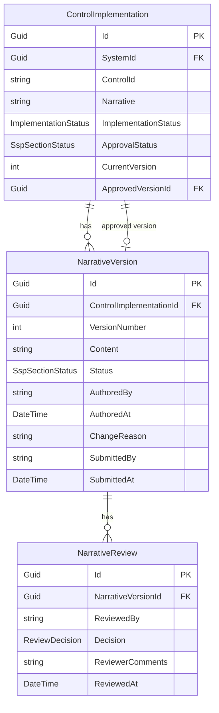

# Data Model: Narrative Governance

**Feature**: 024-narrative-governance
**Date**: 2026-03-11

---

## ER Diagram (Additions)



---

## New Entities

### NarrativeVersion

Append-only record of a single version of a control narrative. Content is immutable once created. The `Status`, `SubmittedBy`, and `SubmittedAt` fields transition through the approval lifecycle. Linked to parent `ControlImplementation` via FK.

| Property | Type | Constraints | Description |
|----------|------|-------------|-------------|
| `Id` | `Guid` | PK | Primary key |
| `ControlImplementationId` | `Guid` | FK → ControlImplementation, required | Parent control implementation |
| `VersionNumber` | `int` | Required, >= 1 | Sequential version number per control |
| `Content` | `string` | Required, MaxLength(8000) | Full narrative text at this version |
| `Status` | `SspSectionStatus` | Required, default `Draft` | Approval status: Draft, InReview, Approved, NeedsRevision |
| `AuthoredBy` | `string` | Required, MaxLength(200) | User who created this version |
| `AuthoredAt` | `DateTime` | Required | UTC timestamp of version creation |
| `ChangeReason` | `string?` | MaxLength(1000) | Optional reason for the change (e.g., "Addressed ISSM feedback") |
| `SubmittedBy` | `string?` | MaxLength(200) | User who submitted this version for review (null until submitted) |
| `SubmittedAt` | `DateTime?` | Nullable | UTC timestamp of submission for review (null until submitted) |

**Indexes:**
- Unique composite: `(ControlImplementationId, VersionNumber)` — ensures sequential version numbering per control
- Non-unique: `(ControlImplementationId, Status)` — supports filtering by approval status

**Relationships:**
- Many-to-one: `NarrativeVersion` → `ControlImplementation` (cascade delete)
- One-to-many: `NarrativeVersion` → `NarrativeReview`

---

### NarrativeReview

Record of a review decision on a specific narrative version. A version can have multiple reviews if it is resubmitted after revision.

| Property | Type | Constraints | Description |
|----------|------|-------------|-------------|
| `Id` | `Guid` | PK | Primary key |
| `NarrativeVersionId` | `Guid` | FK → NarrativeVersion, required | Version being reviewed |
| `ReviewedBy` | `string` | Required, MaxLength(200) | ISSM who performed the review |
| `Decision` | `ReviewDecision` | Required | Approve or RequestRevision |
| `ReviewerComments` | `string?` | MaxLength(2000) | Reviewer feedback (required on RequestRevision) |
| `ReviewedAt` | `DateTime` | Required | UTC timestamp of review |

**Indexes:**
- Non-unique: `(NarrativeVersionId)` — supports lookup of reviews per version

**Relationships:**
- Many-to-one: `NarrativeReview` → `NarrativeVersion` (cascade delete)

---

## Enhanced Entities

### ControlImplementation (new fields)

The following fields are added to the existing `ControlImplementation` entity. All existing fields remain unchanged. Default values ensure backward compatibility with existing data.

| New Property | Type | Constraints | Description |
|--------------|------|-------------|-------------|
| `ApprovalStatus` | `SspSectionStatus` | Required, default `Draft` | Tracks the latest `NarrativeVersion`'s approval status. Resets to Draft when a new version is created on top of an Approved version; `ApprovedVersionId` continues to reference the last approved version for SSP generation. |
| `CurrentVersion` | `int` | Required, default 1 | Latest version number |
| `ApprovedVersionId` | `Guid?` | FK → NarrativeVersion, nullable | Reference to the currently approved version (null if no version has been approved) |

**New Relationships:**
- One-to-many: `ControlImplementation` → `NarrativeVersion` (version history)
- Optional one-to-one: `ControlImplementation` → `NarrativeVersion` (approved version reference via `ApprovedVersionId`)

---

## New Enumerations

### ReviewDecision

```csharp
public enum ReviewDecision
{
    Approve,
    RequestRevision
}
```

> Note: `SspSectionStatus` is reused for narrative approval status (not duplicated). Existing values: `NotStarted`, `Draft`, `InReview`, `Approved`, `NeedsRevision`.

---

## EF Core Configuration

### NarrativeVersion Configuration

```csharp
modelBuilder.Entity<NarrativeVersion>(entity =>
{
    entity.HasKey(e => e.Id);
    entity.Property(e => e.Content).HasMaxLength(8000).IsRequired();
    entity.Property(e => e.AuthoredBy).HasMaxLength(200).IsRequired();
    entity.Property(e => e.ChangeReason).HasMaxLength(1000);
    entity.Property(e => e.SubmittedBy).HasMaxLength(200);
    entity.Property(e => e.Status).HasConversion<string>();

    entity.HasIndex(e => new { e.ControlImplementationId, e.VersionNumber })
          .IsUnique();
    entity.HasIndex(e => new { e.ControlImplementationId, e.Status });

    entity.HasOne<ControlImplementation>()
          .WithMany()
          .HasForeignKey(e => e.ControlImplementationId)
          .OnDelete(DeleteBehavior.Cascade);
});
```

### NarrativeReview Configuration

```csharp
modelBuilder.Entity<NarrativeReview>(entity =>
{
    entity.HasKey(e => e.Id);
    entity.Property(e => e.ReviewedBy).HasMaxLength(200).IsRequired();
    entity.Property(e => e.ReviewerComments).HasMaxLength(2000);
    entity.Property(e => e.Decision).HasConversion<string>();

    entity.HasOne<NarrativeVersion>()
          .WithMany()
          .HasForeignKey(e => e.NarrativeVersionId)
          .OnDelete(DeleteBehavior.Cascade);
});
```

### ControlImplementation Configuration (additions)

```csharp
// Add to existing ControlImplementation configuration:
entity.Property(e => e.ApprovalStatus)
      .HasConversion<string>()
      .HasDefaultValue(SspSectionStatus.Draft);
entity.Property(e => e.CurrentVersion)
      .HasDefaultValue(1);
entity.HasOne<NarrativeVersion>()
      .WithOne()
      .HasForeignKey<ControlImplementation>(e => e.ApprovedVersionId)
      .OnDelete(DeleteBehavior.SetNull);
```

---

## Database Migration Notes

- New tables: `NarrativeVersions`, `NarrativeReviews`
- Altered table: `ControlImplementations` (3 new columns with defaults)
- Existing `ControlImplementation` rows will have `ApprovalStatus = Draft`, `CurrentVersion = 1`, `ApprovedVersionId = null`
- A data migration should create a `NarrativeVersion` (version 1) for each existing `ControlImplementation` row that has a non-null/non-empty `Narrative` to bootstrap the version history
