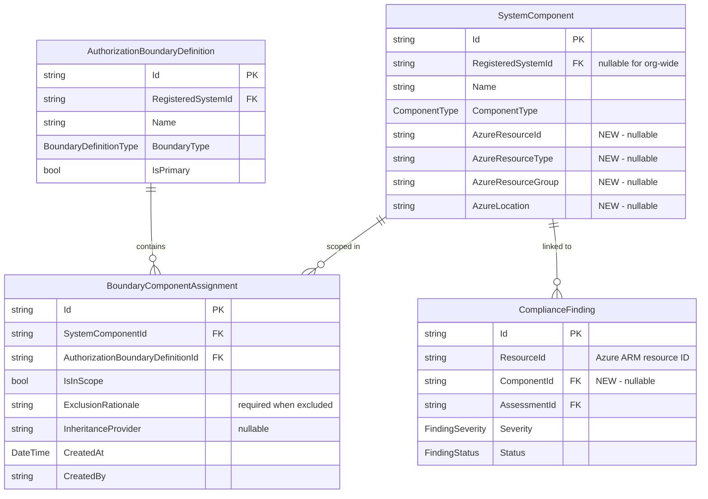

# Data Model: Component-Centric Boundary Model

**Feature**: 040-component-centric-boundary  
**Date**: 2026-03-19  
**Depends on**: [research.md](research.md) (R1, R4, R5)

---

## Entity Changes Overview

| Entity | Action | Description |
|--------|--------|-------------|
| `SystemComponent` | MODIFY | Add 4 Azure resource fields |
| `BoundaryComponentAssignment` | NEW | Join entity for boundary-component scope |
| `ComplianceFinding` | MODIFY | Add optional `ComponentId` FK |
| `AuthorizationBoundary` | DEPRECATE | Mark read-only; no new inserts |
| `AuthorizationBoundaryDefinition` | MODIFY | Add navigation to `BoundaryComponentAssignment` |

---

## New Entity: BoundaryComponentAssignment

```csharp
namespace Ato.Copilot.Core.Models.Compliance;

/// <summary>
/// Links a <see cref="SystemComponent"/> to an <see cref="AuthorizationBoundaryDefinition"/>
/// with per-boundary scope status (In Scope or Excluded).
/// Replaces the scope-tracking role of <see cref="AuthorizationBoundary"/>.
/// </summary>
public class BoundaryComponentAssignment
{
    [Key]
    [MaxLength(36)]
    public string Id { get; set; } = Guid.NewGuid().ToString();

    /// <summary>FK to the component.</summary>
    [Required]
    [MaxLength(36)]
    public string SystemComponentId { get; set; } = string.Empty;

    /// <summary>FK to the boundary definition.</summary>
    [Required]
    [MaxLength(36)]
    public string AuthorizationBoundaryDefinitionId { get; set; } = string.Empty;

    /// <summary>true = in scope, false = excluded from boundary.</summary>
    [Required]
    public bool IsInScope { get; set; } = true;

    /// <summary>Required when IsInScope is false. Explains why the component is excluded.</summary>
    [MaxLength(1000)]
    public string? ExclusionRationale { get; set; }

    /// <summary>CSP or common control provider if scope is inherited.</summary>
    [MaxLength(200)]
    public string? InheritanceProvider { get; set; }

    /// <summary>UTC timestamp when the assignment was created.</summary>
    public DateTime CreatedAt { get; set; } = DateTime.UtcNow;

    /// <summary>User who created the assignment.</summary>
    [Required]
    [MaxLength(200)]
    public string CreatedBy { get; set; } = string.Empty;

    /// <summary>Last modification timestamp (UTC).</summary>
    public DateTime? ModifiedAt { get; set; }

    /// <summary>User who last modified the assignment.</summary>
    [MaxLength(200)]
    public string? ModifiedBy { get; set; }

    // ─── Navigation ──────────────────────────────────────────────────────────

    public SystemComponent SystemComponent { get; set; } = null!;
    public AuthorizationBoundaryDefinition AuthorizationBoundaryDefinition { get; set; } = null!;
}
```

### Indexes

| Index | Columns | Unique | Purpose |
|-------|---------|--------|---------|
| `IX_BCA_ComponentBoundary` | `SystemComponentId`, `AuthorizationBoundaryDefinitionId` | YES | Prevent duplicate assignments; lookup by component+boundary |
| `IX_BCA_BoundaryId` | `AuthorizationBoundaryDefinitionId` | NO | List components for a boundary |

### Validation Rules

- `ExclusionRationale` is **required** when `IsInScope = false` (enforced in service layer, not DB constraint).
- The same `SystemComponentId` + `AuthorizationBoundaryDefinitionId` combination must be unique (DB constraint).

---

## Modified Entity: SystemComponent

### New Fields

```csharp
// ─── Azure Resource Fields (Feature 040) ────────────────────────────────────

/// <summary>Azure ARM resource ID (e.g., /subscriptions/.../resourceGroups/.../providers/...).</summary>
[MaxLength(500)]
public string? AzureResourceId { get; set; }

/// <summary>Azure resource type (e.g., "Microsoft.Compute/virtualMachines").</summary>
[MaxLength(200)]
public string? AzureResourceType { get; set; }

/// <summary>Azure resource group name.</summary>
[MaxLength(200)]
public string? AzureResourceGroup { get; set; }

/// <summary>Azure region (e.g., "usgovvirginia").</summary>
[MaxLength(100)]
public string? AzureLocation { get; set; }
```

### New Navigation

```csharp
/// <summary>Boundary assignments for this component.</summary>
public ICollection<BoundaryComponentAssignment> BoundaryAssignments { get; set; }
    = new List<BoundaryComponentAssignment>();
```

### New Indexes

| Index | Columns | Unique | Purpose |
|-------|---------|--------|---------|
| `IX_SC_AzureResourceId` | `AzureResourceId` | NO | Lookup by Azure resource ID for dedup + finding linkage |

**Note**: Not unique because the same Azure resource could be imported at org level (null `RegisteredSystemId`) and system level (non-null `RegisteredSystemId`), though the UI will warn against this.

---

## Modified Entity: ComplianceFinding

### New Fields

```csharp
// ─── Component Linkage (Feature 040) ────────────────────────────────────────

/// <summary>
/// FK to the <see cref="SystemComponent"/> whose AzureResourceId matches this finding's ResourceId.
/// Null when the finding's resource has not been imported as a component.
/// </summary>
[MaxLength(36)]
public string? ComponentId { get; set; }

// ─── Navigation ─────────────────────────────────────────────────────────────

/// <summary>Linked component (nullable).</summary>
public SystemComponent? Component { get; set; }
```

### New Indexes

| Index | Columns | Unique | Purpose |
|-------|---------|--------|---------|
| `IX_CF_ComponentId` | `ComponentId` | NO | Aggregate findings per component for risk summaries |

---

## Modified Entity: AuthorizationBoundaryDefinition

### New Navigation

```csharp
/// <summary>Component assignments within this boundary (Feature 040).</summary>
public ICollection<BoundaryComponentAssignment> ComponentAssignments { get; set; }
    = new List<BoundaryComponentAssignment>();
```

---

## Deprecated Entity: AuthorizationBoundary

No schema changes. Marked as deprecated in code comments. After migration:
- **No new rows** written by application code.
- **Read-only** for backward compatibility.
- Retained in DbContext and database.

---

## DbContext Configuration

```csharp
// ─── BoundaryComponentAssignment (Feature 040) ─────────────────────────────

public DbSet<BoundaryComponentAssignment> BoundaryComponentAssignments
    => Set<BoundaryComponentAssignment>();

// In OnModelCreating:
modelBuilder.Entity<BoundaryComponentAssignment>(e =>
{
    e.HasIndex(x => new { x.SystemComponentId, x.AuthorizationBoundaryDefinitionId })
        .IsUnique();
    e.HasIndex(x => x.AuthorizationBoundaryDefinitionId);

    e.HasOne(x => x.SystemComponent)
        .WithMany(c => c.BoundaryAssignments)
        .HasForeignKey(x => x.SystemComponentId)
        .OnDelete(DeleteBehavior.Cascade);

    e.HasOne(x => x.AuthorizationBoundaryDefinition)
        .WithMany(b => b.ComponentAssignments)
        .HasForeignKey(x => x.AuthorizationBoundaryDefinitionId)
        .OnDelete(DeleteBehavior.Cascade);
});

// SystemComponent Azure field index:
modelBuilder.Entity<SystemComponent>(e =>
{
    e.HasIndex(x => x.AzureResourceId);
});

// ComplianceFinding ComponentId:
modelBuilder.Entity<ComplianceFinding>(e =>
{
    e.HasIndex(x => x.ComponentId);

    e.HasOne(x => x.Component)
        .WithMany()
        .HasForeignKey(x => x.ComponentId)
        .OnDelete(DeleteBehavior.SetNull);
});
```

---

## ER Diagram (Feature 040 Additions)



---

## State Transitions

### BoundaryComponentAssignment Scope

```
┌──────────┐      Toggle (no rationale needed)      ┌──────────┐
│ In Scope │ ────────────────────────────────────→   │ Excluded │
│          │ ←────────────────────────────────────   │          │
└──────────┘      Toggle (clears rationale)          └──────────┘
                                                        │
                                                        │ Requires:
                                                        │ - ExclusionRationale (non-empty)
                                                        │ Before save
```

### Data Migration Flow

```
AuthorizationBoundary rows
    │
    ├─ Group by ResourceId (dedup)
    │   └─ Create one SystemComponent per unique ResourceId
    │       ├─ AzureResourceId = ResourceId
    │       ├─ AzureResourceType = ResourceType
    │       ├─ AzureResourceGroup = extracted from ResourceId
    │       ├─ AzureLocation = (not in old model - set null)
    │       ├─ Name = ResourceName ?? resource type + short ID
    │       ├─ ComponentType = Thing
    │       └─ RegisteredSystemId = null (org-wide)
    │
    └─ For each original row
        └─ Create BoundaryComponentAssignment
            ├─ SystemComponentId = new component ID
            ├─ AuthorizationBoundaryDefinitionId = row.AuthorizationBoundaryDefinitionId
            ├─ IsInScope = row.IsInBoundary
            ├─ ExclusionRationale = row.ExclusionRationale
            ├─ InheritanceProvider = row.InheritanceProvider
            └─ CreatedBy = "migration"
```

---

## Migration-Status Tracking

A simple flag entity or application setting tracks whether the migration has run:

```csharp
// Check in BoundaryMigrationService.RunAsync():
// 1. Query for a sentinel row: SELECT * FROM __MigrationFlags WHERE Name = 'F040_BoundaryToComponent'
// 2. If found, skip migration.
// 3. If not found, run migration within transaction, then insert flag row, then commit.
```

This avoids re-running the migration on subsequent startups.
